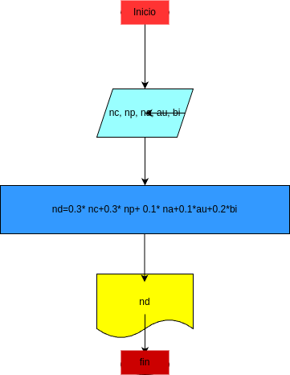

# nota_definitiva
Programa en Python para calcular la Nota definitiva de una asignatura en el Colegio Guanentá

# Analisis

### Variables de entrada
- nc: Nota Cognitiva
- np: Nota Procedimental
- na: Nota Actitudinal
- au: Autoevaluación
- bi: Bimestral

### Procesamiento 
- nd: Nota Definitiva

$nd = 0.3*np+0.1*na+0.1*au+0.2*bi$

## Diseño 

## Construcción

- Codigo implementado en el archivo nota_definitiva.py